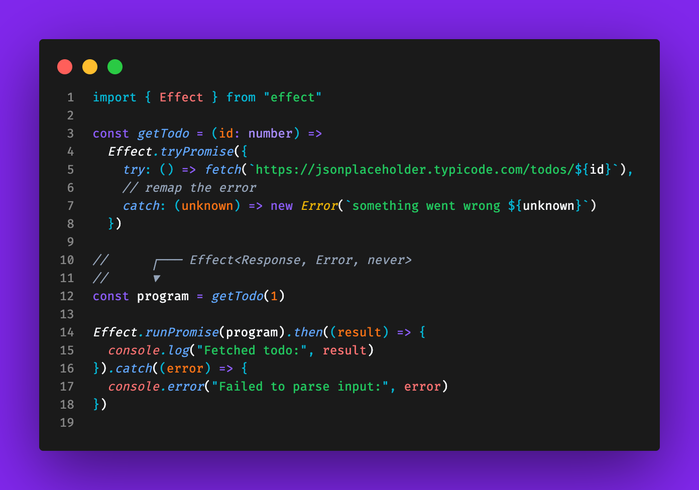
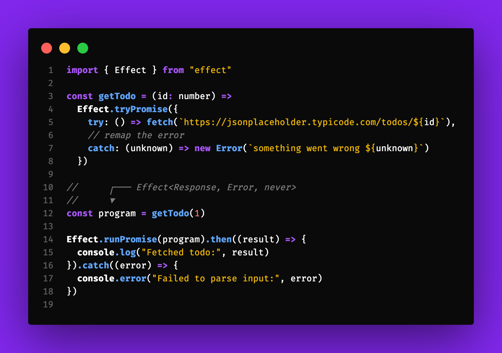
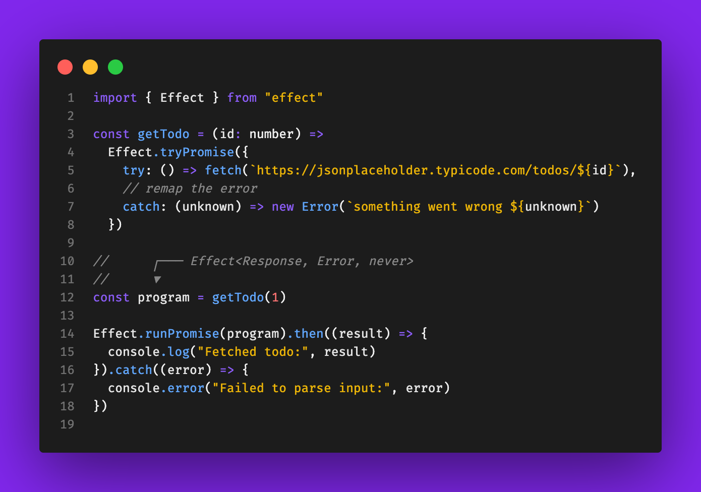
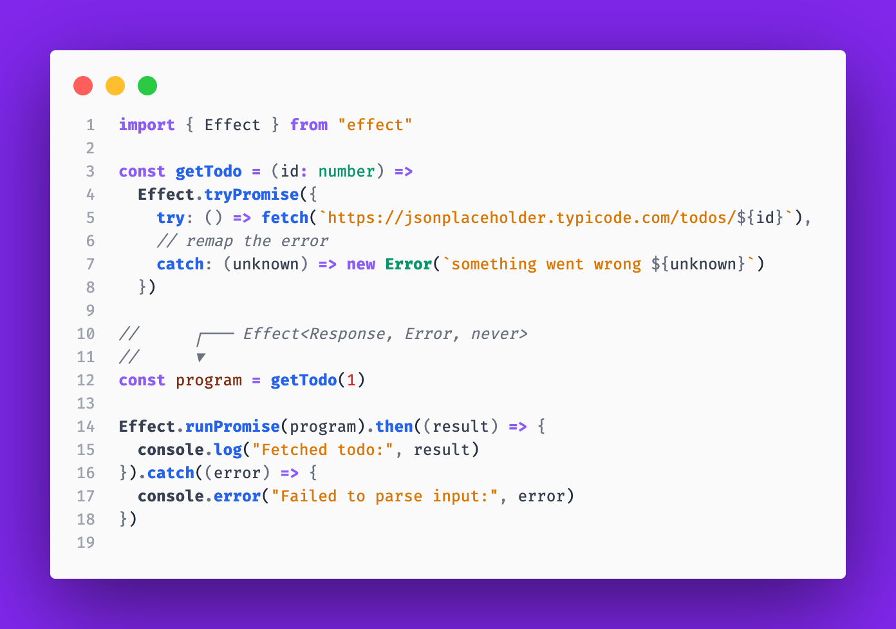
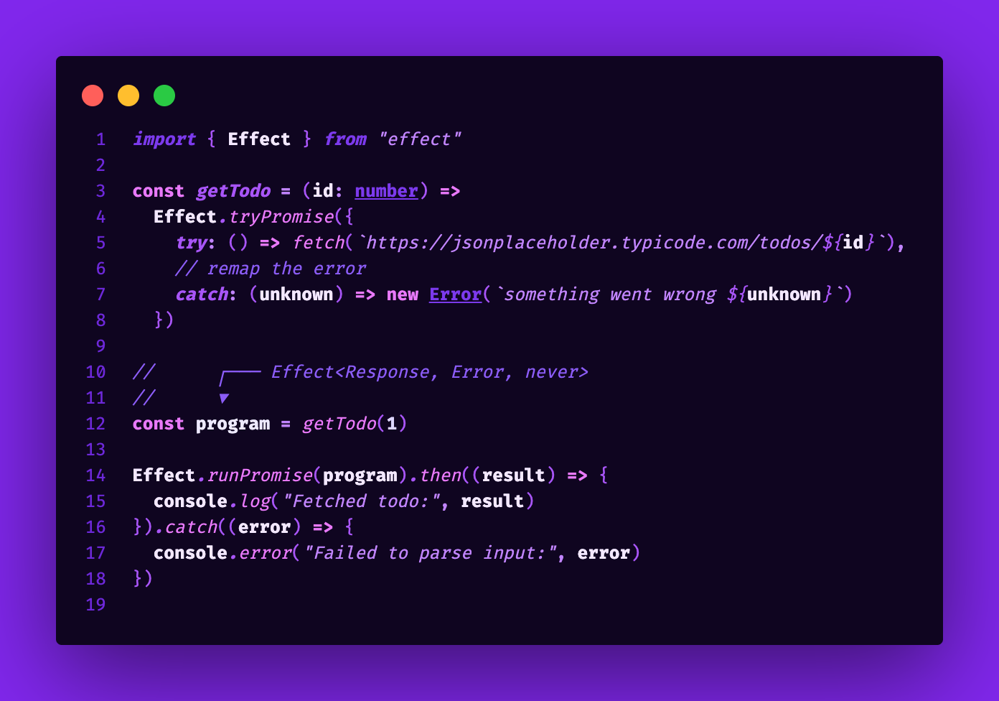

# 🥋 Hakko Ryu Theme Collection for VS Code

A complete theme collection inspired by the martial art of <span style="color: #8B5CF6">**Hakko Ryu**</span> and the colors of the <span style="color: #3B82F6">Ro</span><span style="color: #EAB308">ma</span><span style="color: #F87171">nian</span> flag.

## 📸 Screenshots

## Standard Theme



## High Contrast Theme



## Soft Theme



## Light Theme



## Master Theme - "You Are a Master of the Eight Colors" ✨



## 🎨 Theme Variants

This collection includes **five carefully crafted variants** to suit different preferences, accessibility needs, and coding environments:

### 🌟 **Standard** - Perfect Balance

- **🌙 Balanced contrast** for comfortable daily coding
- **🎯 Optimal readability** without eye strain
- **✨ Classic Hakko Ryu** color philosophy

### ⚡ **High Contrast** - Maximum Clarity

- **🔥 Enhanced contrast** for better accessibility
- **💪 Bolder colors** for users who prefer vivid themes
- **🎪 Deeper blacks** and brighter accents

### 🌸 **Soft** - Gentle Focus

- **😌 Reduced intensity** for extended coding sessions
- **🕯️ Warmer tones** for a more relaxed feel
- **🌅 Subtle contrasts** that are easy on the eyes

### ☀️ **Light** - Pure Clarity

- **🤍 Soft off-white background** symbolizing clarity and cleanliness
- **📖 Perfect for documentation** and daytime coding
- **👁️ Gentle on the eyes** with warm, comfortable tones
- **🎨 Maintains color philosophy** with light-optimized palette

### ✨ **You Are a Master of the Eight Colors** - Ultimate Expression

- **🟣 Bold all-purple theme** for those who have achieved mastery
- **🌌 Deep purple backgrounds** (#0F0520, #1A0B2E) for immersive coding
- **⚡ Strong contrasts** with vibrant purple accents
- **💫 Expressive typography**: **bold variables**, _italic functions_
- **🎭 Rich purple palette** from soft lavender to deep violet
- **🥋 Embodies the philosophy** of Hakko Ryu mastery

## 🎨 Color Palette

This theme features a carefully crafted color palette with four key colors:

- **🟣 Primary Purple** (<span style="color: #8B5CF6">#8B5CF6</span>) - Representing the eighth light of <span style="color: #8B5CF6">Hakko Ryu</span>
- **🔵 Blue** (<span style="color: #60A5FA">#60A5FA</span>) - Inspired by the <span style="color: #3B82F6">Ro</span><span style="color: #EAB308">ma</span><span style="color: #F87171">nian</span> flag
- **🟡 Yellow** (<span style="color: #EAB308">#EAB308</span>) - Inspired by the <span style="color: #3B82F6">Ro</span><span style="color: #EAB308">ma</span><span style="color: #F87171">nian</span> flag
- **🔴 Red** (<span style="color: #F87171">#F87171</span>) - Inspired by the <span style="color: #3B82F6">Ro</span><span style="color: #EAB308">ma</span><span style="color: #F87171">nian</span> flag

## 💫 About the Inspiration

This theme was born from my personal journey with **🥋 <span style="color: #8B5CF6">Hakko Ryu Jujutsu</span>**, a martial art that has been a meaningful part of my life since 2010. <span style="color: #8B5CF6">Hakko Ryu</span>, meaning "The Style of the Eighth Light," refers to the invisible yet powerful ultraviolet band of light - much like how subtle code can have profound impact.

The 🟣 purple represents the essence of <span style="color: #8B5CF6">Hakko Ryu's</span> philosophy: strength that appears gentle, power that flows like water, and techniques that work through harmony rather than force. Combined with the 🇷🇴 <span style="color: #3B82F6">blue</span>, <span style="color: #EAB308">yellow</span>, and <span style="color: #F87171">red</span> of the <span style="color: #3B82F6">Ro</span><span style="color: #EAB308">ma</span><span style="color: #F87171">nian</span> flag, this theme reflects both my martial arts heritage and cultural identity.

Just as <span style="color: #8B5CF6">Hakko Ryu</span> emphasizes **⚡ <span style="color: #8B5CF6">datsuryoku</span>** (effortless power) and **☯️ <span style="color: #8B5CF6">harmony</span>**, this theme aims to provide a coding environment that feels natural and reduces eye strain during long development sessions.

## ✨ Features

- **🌙 Dark background** (<span style="color: #1A1A1A; background-color: #F8FAFC; padding: 2px 4px; border-radius: 3px;">#1A1A1A</span>) for reduced eye strain
- **👁️ High contrast** syntax highlighting for better readability
- **🧠 Semantic color usage** that makes code structure intuitive
- **🎯 Consistent color scheme** across all VS Code elements
- **🇷🇴 <span style="color: #3B82F6">Ro</span><span style="color: #EAB308">ma</span><span style="color: #F87171">nian</span> flag-inspired accents** for variables, functions, and keywords

## 📦 Installation

### 🛒 From VS Code Marketplace (Recommended)

1. � Open VS Code
2. 🔍 Press `Ctrl+Shift+X` (or `Cmd+Shift+X` on Mac) to open Extensions view
3. 🔎 Search for "**Hakko Ryu Theme**"
4. 📥 Click **Install** on the theme by Alexandru Barbulescu
5. 🎨 Press `Ctrl+Shift+P` (or `Cmd+Shift+P` on Mac) and type "**Color Theme**"
6. ✨ Select "**Preferences: Color Theme**" and choose your preferred variant:
   - **Hakko Ryu Theme** (Standard - Dark)
   - **Hakko Ryu Theme (High Contrast)** (Dark)
   - **Hakko Ryu Theme (Soft)** (Dark)
   - **Hakko Ryu Theme (Light)** (Light)

### 🌐 Alternative Installation Methods

#### Via Command Line

```bash
code --install-extension alexandrubb23.hakko-theme
```

#### Manual Installation

1. 📥 Download the latest `.vsix` file from the [releases page](https://github.com/alexandrubb23/hakko-ryu-theme/releases)
2. 🚀 Open VS Code
3. ⌨️ Press `Ctrl+Shift+P` (or `Cmd+Shift+P` on Mac)
4. 🔍 Type "**Extensions: Install from VSIX...**"
5. 📁 Select the downloaded `.vsix` file
6. 🎨 Apply the theme via `Ctrl+Shift+P` > "**Preferences: Color Theme**" > "**Hakko Ryu Theme**"

## ⚡ Quick Start

After installation, the theme will be immediately available in your color theme list. You can quickly switch themes using:

- **Keyboard shortcut**: `Ctrl+K Ctrl+T` (or `Cmd+K Cmd+T` on Mac)
- **Command Palette**: `Ctrl+Shift+P` → "Preferences: Color Theme"

## 📋 Requirements

- **VS Code Version**: 1.74.0 or higher
- **Platform**: Compatible with Windows, macOS, and Linux
- **File Types**: Optimized for JavaScript, TypeScript, Python, HTML, CSS, JSON, Markdown, and more

## 🧘‍♂️ Philosophy

> 💡 "True efficiency is invisible to the eyes, just as the ultra-violet rays - the eighth color on the spectrum of light, invisible but very powerful."

This theme embodies the same principle: providing powerful functionality through subtle, harmonious design.

## 🤝 Contributing

Feel free to submit issues and enhancement requests! This theme is a labor of love, combining passion for martial arts and clean code.

### 🐛 Found a Bug or Have a Suggestion?

- 📝 [Create an issue](https://github.com/alexandrubb23/hakko-ryu-theme/issues) on GitHub
- ⭐ Give this project a star if you like it!
- 📧 Contact: [alex_bb23@yahoo.co.uk](mailto:alex_bb23@yahoo.co.uk)

### 🎨 Theme Requests

If you'd like variations of this theme (light version, different accent colors, etc.), please let me know in the issues!

---

_💻 Developed with passion for both code and martial arts 🥋_

## 🏷️ Tags

`#vscode-theme` `#dark-theme` `#hakko-ryu` `#martial-arts` `#romania` `#purple-theme`
